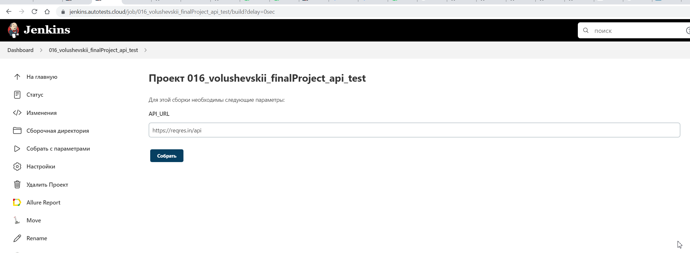
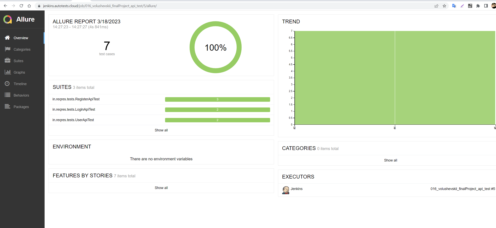
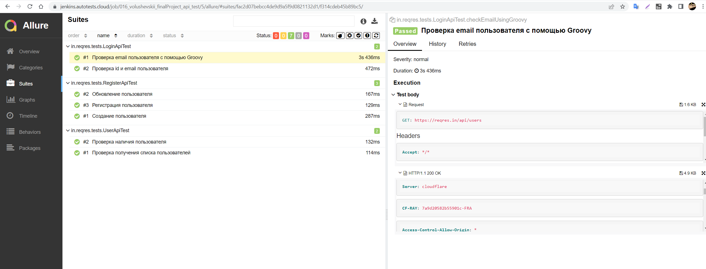
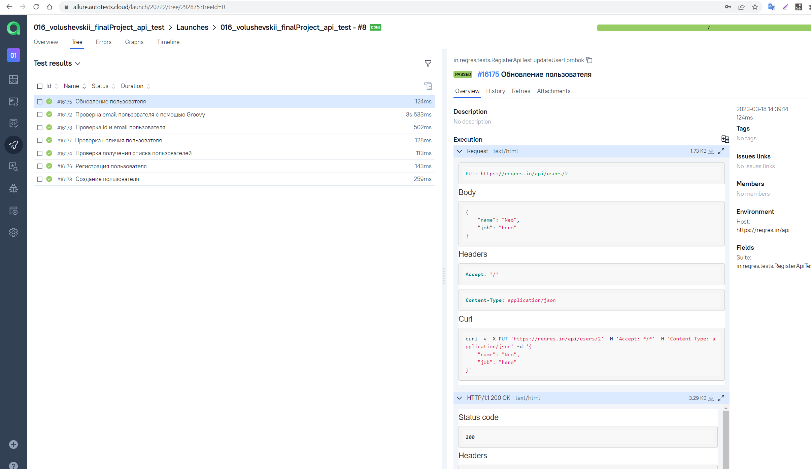
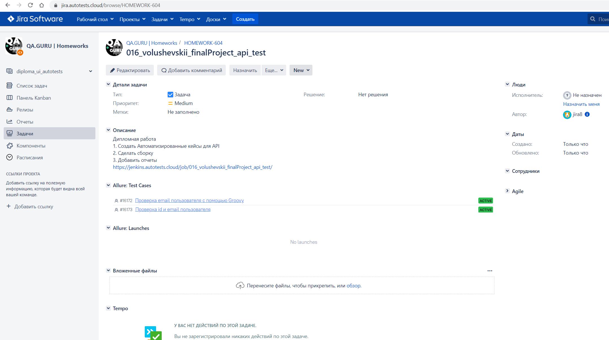
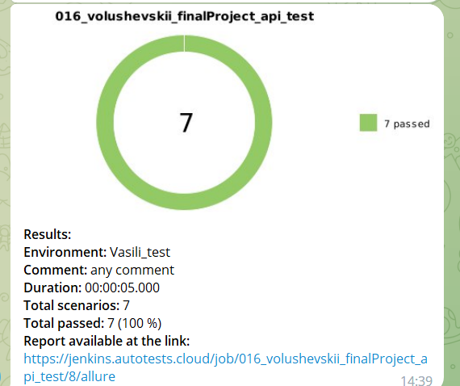

# Дипломный проект по автоматизации тестирования web

## 	Содержание

> ➠ Общая информация о проекте
>
> ➠ [Запуск тестов из терминала](#запуск-тестов-из-терминала)
>
> ➠ [Запуск тестов в Jenkins](#-удаленный-запуск-тестов-в-Jenkins)
>
> ➠ [Отчет о результатах тестирования в Allure Report](#-главная-страница-allure-отчета)
>
> ➠ [Тест кейсы в Allure Test Ops](#-тест-кейсы-в-allure-test-ops)
> 
> ➠ [Интеграция с Jira](#-интеграция-с-jira)
>
> ➠ [Уведомления в Telegram с использованием бота](#-уведомления-в-telegram-с-использованием-бота)
>
> ➠ [Api сервис REQRES](#api-сервис-reqres)
>
> ➠ [Покрытый функционал api сервиса](#покрытый-функционал-api-сервиса)
>
> ➠ [Технологический стек API](#технологический-стек-api)


##  Общая информация о проекте

### Запуск тестов из терминала

### Локальный запуск тестов

#### Локальный запуск тестов с использованием параметров из property файла

```
gradle clean test -Denv={имя property файла в папке test.resources}
```

#### Локальный запуск тестов с использованием параметров из property файла test

```
gradle clean test
```

#### Описание параметров для запуска тестов

>
>
> -DapiBaseUrl <code>url для запуска api тестов</code>
>


### Удаленный запуск тестов

#### Удалённый запуск через передачу параметров

```
gradle clean test 
-DapiBaseUrl="${API_URL}"
```


##  Удаленный запуск тестов в Jenkins

> Для запуска тестов используется параметризированная сборка

<p align="center">

</p>

##  Главная страница allure отчета

<p align="center">

</p>

###  Группировка тестов по проверяемому функционалу

<p align="center">

</p>

###  Основной дашборд

<p align="center">

</p>

###  Тест кейсы в Allure Test Ops
<p align="center">

</p>

###  Интеграция с Jira

<p align="center">

</p>

##  Уведомления в Telegram с использованием бота

> После завершения сборки специальный бот, созданный в <code>Telegram</code>, автоматически обрабатывает и отправляет сообщение с отчетом о прогоне.
>
> Информация по настройке и использованию бота <code>https://github.com/qa-guru/allure-notifications</code>

<p align="center">

</p>


##  Api сервис REQRES

###  Покрытый функционал api сервиса

> Разработаны автотесты на <code>Api сервис</code>.
### Api

- [x] Получение списка пользователей
- [x] Проверка наличия пользователя
- [x] Создание пользователя
- [x] Обновление пользователя
- [x] Регистрация пользователя
- [x] Проверка id и email пользователя
- [x] Проверка email пользователя с помощью Groovy


### Технологический стек API

<p align="center">


</p>

### В данном подпроекте автотесты написаны на <code>Java</code> с использованием <code>Rest Assured</code> для Api-тестов.
>
> <code>Rest Assured</code> выполняет роль обёртки над http клиентом.
>
> <code>Allure Report</code> формирует отчет о запуске тестов.
>
> Для автоматизированной сборки проекта используется <code>Gradle</code>.
>
> В качестве библиотеки для модульного тестирования используется <code>JUnit 5</code>.
>
> <code>Jenkins</code> выполняет запуск тестов.
>
> После завершения прогона отправляются уведомления с помощью бота в <code>Telegram</code>.
